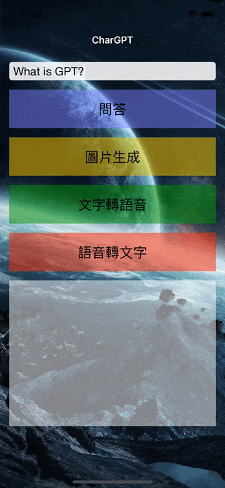

# WWSimpleChatGPT
[](https://developer.apple.com/swift/) [](https://developer.apple.com/swift/)  [](https://developer.apple.com/swift/) [](https://developer.apple.com/swift/)

## [Introduction - 簡介](https://swiftpackageindex.com/William-Weng)
- Simply use the functionality of ChatGPT.
- 簡單的使用ChatGPT的功能。



### [Installation with Swift Package Manager](https://medium.com/彼得潘的-swift-ios-app-開發問題解答集/使用-spm-安裝第三方套件-xcode-11-新功能-2c4ffcf85b4b)
```js
dependencies: [
    .package(url: "https://github.com/William-Weng/WWSimpleChatGPT.git", .upToNextMajor(from: "0.5.0"))
]
```

### [Function - 可用函式](https://platform.openai.com/)
|函式|功能|
|-|-|
|configure(bearerToken:version)|[設定bearerToken](https://platform.openai.com/account/api-keys)|
|chat(model:role:temperature:content:)|[執行聊天功能](https://platform.openai.com/docs/api-reference/making-requests)|
|image(model:prompt:n:size:)|文字生成圖片|
|speech(model:voice:speed:input:)|文字轉語音|
|whisper(model:audio:)|語音轉文字|

### Example - 範例
```swift
import UIKit
import WWHUD
import WWSimpleChatGPT

final class ViewController: UIViewController {
    
    private let bearerToken = "<bearerToken>"
    
    @IBOutlet weak var myTextField: UITextField!
    @IBOutlet weak var resultTextView: UITextView!
    
    override func viewDidLoad() {
        super.viewDidLoad()
        initSetting()
    }
    
    @IBAction func chat(_ sender: UIButton) { chatAction(content: myTextField.text) }
    @IBAction func images(_ sender: UIButton) { imagesAction(prompt: myTextField.text, count: 5) }
    @IBAction func speech(_ sender: UIButton) { speechAction(input: myTextField.text) }
    @IBAction func whisper(_ sender: UIButton) { whisperAction(filename: "speech.mp3") }
}

private extension ViewController {
    
    func initSetting() {
        WWSimpleChatGPT.configure(bearerToken: bearerToken)
    }
    
    func displayResult<T>(result: Result<T?, Error>) {
        
        switch result {
        case .failure(let error): resultTextView.text = "\(error)"
        case .success(let value): resultTextView.text = "\(String(describing: value))"
        }
        
        WWHUD.shared.dismiss(completion: nil)
    }
    
    func loading() {
        guard let url = Bundle.main.url(forResource: "loading.gif", withExtension: nil) else { return }
        WWHUD.shared.display(effect: .gif(url: url), height: 256)
    }
}

private extension ViewController {
    
    func chatAction(content: String?) {
        
        guard let content = content else { return }
        
        loading()
        
        Task {
            let result = await WWSimpleChatGPT.shared.chat(content: content)
            displayResult(result: result)
        }
    }
    
    func imagesAction(prompt: String?, count: Int) {
     
        guard let prompt = prompt else { return }
        
        loading()
        
        Task {
            let result = await WWSimpleChatGPT.shared.image(model: .v2, prompt: prompt, n: count, size: ._256x256)
            displayResult(result: result)
        }
    }
    
    func speechAction(input: String?) {
        
        guard let input = input else { return }
        
        loading()
        
        Task {
            let result = await WWSimpleChatGPT.shared.speech(input: input)
            displayResult(result: result)
        }
    }
    
    func whisperAction(filename: String) {
        
        guard let url = Bundle.main.url(forResource: filename, withExtension: nil),
              let data = try? Data(contentsOf: url)
        else {
            return
        }

        loading()
        
        Task {
            let result = await WWSimpleChatGPT.shared.whisper(model: .v1, audio: (type: .mp3, data: data))
            displayResult(result: result)
        }
    }
}
```
